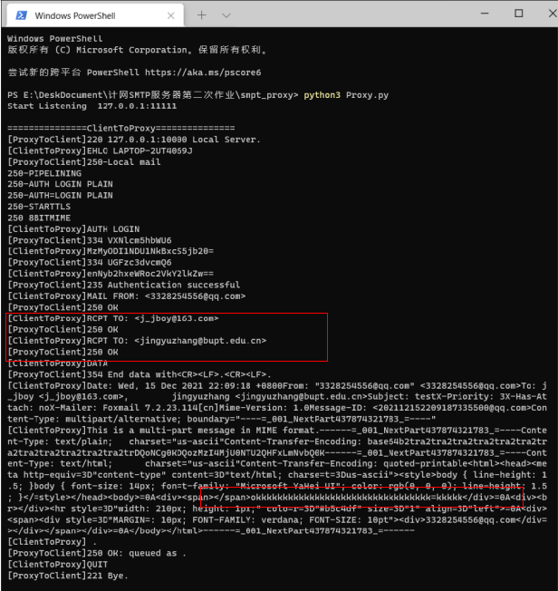
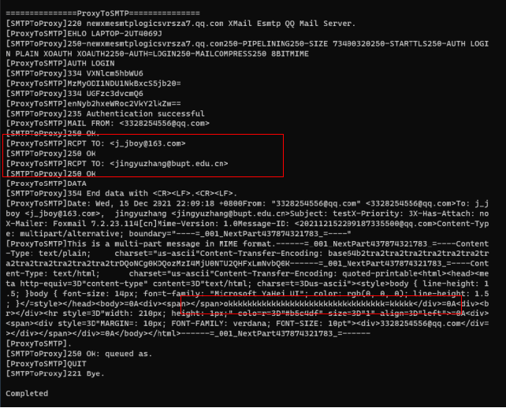

# SMTP_Proxy
SMTP代理服务器

## 开发环境

Windows10、Python3.10、PyCharm2021、Foxmail

## 项目内容

使用Socket API编写一个SMTP邮件代理服务器程序， 该程序使用 SMTP 接收来自邮件客户端（如 Foxmail、Outlook 等）的邮件，并转发给实际的接收邮件服务器的用户邮箱（如@qq.com、@bupt.edu.cn 等），除完成SMTP 代理服务器的基本功能外，完成SMTP 代理服务器的高级功能，一是采用多线程方式，作为 SMTP 服务器的接收线程（一直监听）、作为 SMTP 客户端的发送线程（临时开启）；二是采用邮件队列方式，要求支持邮件客户端连续发送多封邮件。 

## py文件功能介绍

· Proxy.py:main函数，程序入口

· build_socket.py:启动代理监听，执行代理功能

· Receive(conn):代理与客户端进行通信,conn为代理和客户端建立起的套接字

· Send(SMTP_host,SMTP_port):SMTP_host是SMTP服务器地址，SMTP_port是服	 务器开放端口

· Mail_format.py:与客户端进行通信时保留的内容，方便后续与服务器通信

· ClientToProxy.py:客户端与代理进行通信

· ProxyToSMTP:代理与客户端进行通信

## 代码逻辑

Proxy.py调用线程build_socket_thread，执行listen函数，启用监听，一旦客户端发送消息，就与代理建立连接，进行通信，在通信过程中，收集客户端发送的消息放在message中，若邮件格式错误或通信出现错误，即返回给客户端500 ERROR并结束通信，然后开启发送线程，与SMTP服务器进行通信，将message发送给服务器，中途若通信出现错误，返回给客户端500 ERROR并结束通信。

## 功能测试图

### ClientToProxy

### ProxyToSMTP

## 对比实际的SMTP服务器

本代理完全按照SMTP协议进行与客户端和服务器进行通信

### 优点
1.数据完全掌握在本地，可以及时根据需求对邮件通信进行调整。

2.在本地的代理可以先对邮件进行初步筛选，不会将已经检测出错误的邮件发送给实际SMTP服务器，缓解服务器压力。

3.通信过程清晰可见，如果发生错误，可以快速定位是邮件的哪一部分不符合规范。

### 缺点
1.自己搭建代理中的好多功能（比如垃圾邮件过滤）没有实际的邮箱做得好。

2.只记录邮件代理开启时的数据，没有对历史邮件数据进行存储。